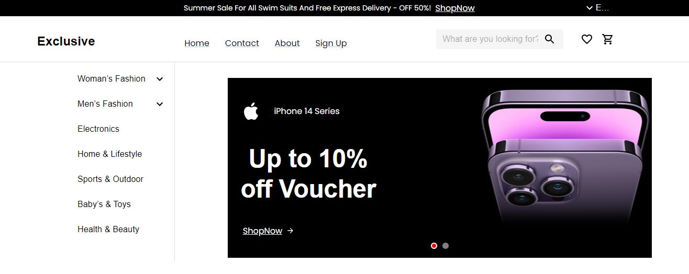
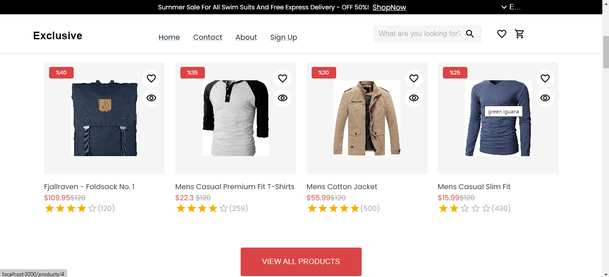
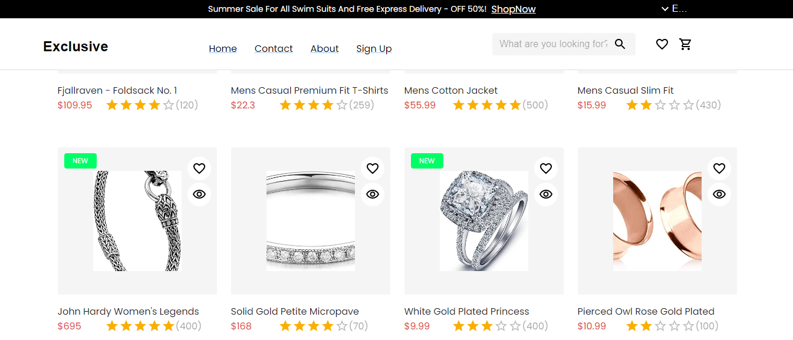
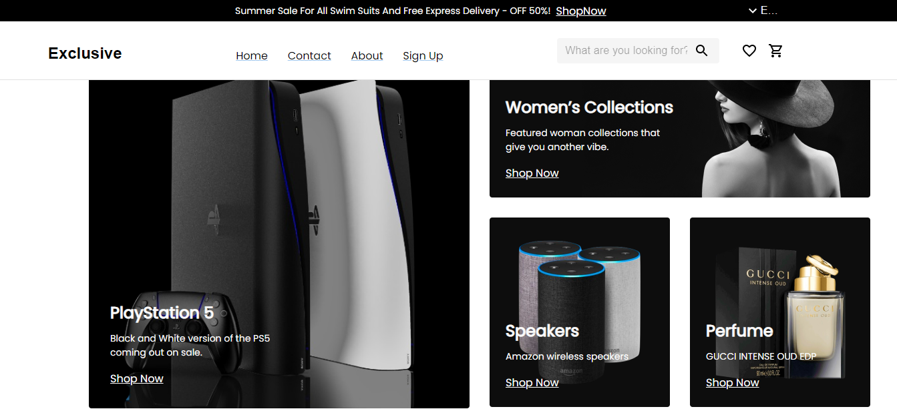
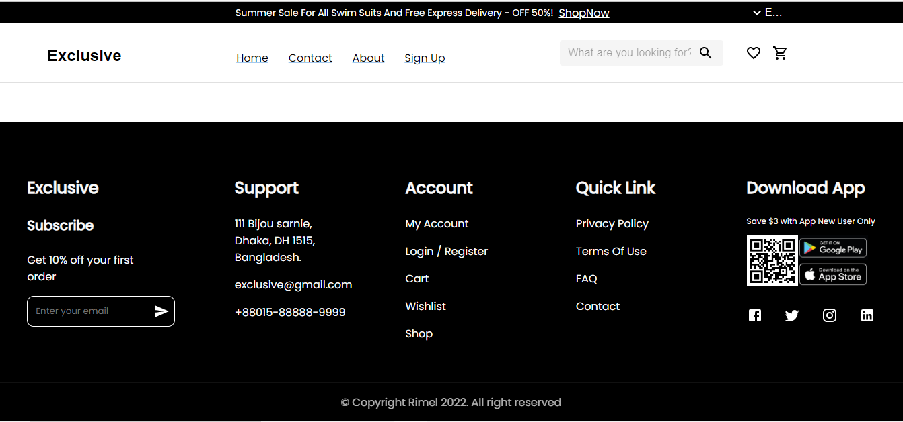
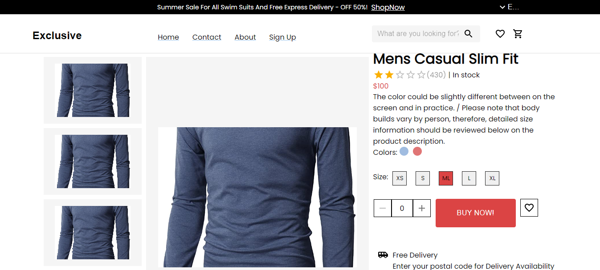

# Full E-Commerce Website

Welcome to our super project! This project was built at the request of Gaza Sky Geeks as it was required during our training.
We build this project for learning purpose. we use React Library to build it, with Material UI Kit.

## Authors

- [Ibraheem Shawhnee](https://github.com/IbraheemShawhnee)

- [Yazan Habash](https://github.com/Yazan-Habash114)

- [Abdallah Jabr](https://github.com/Yazan-Habash114)

- [Zaid Melhem](https://github.com/Yazan-Habash114)
  [](https://app.netlify.com/sites/playful-granita-f7c87b/deploys)

## Installation

Install our project with git

```git
  $ git clone https://github.com/Yazan-Habash114/e-commerce-app.git
```

```git
// Install Node Modules
  $ npm i
```

```git
// To install MUI Kit

// npm
  $ npm install @mui/material @emotion/react @emotion/styled
// yarn
  $ yarn add @mui/material @emotion/react @emotion/styled

```

```git
// To install MUI Icons Kit

// npm
  $ npm install @mui/icons-material
// yarn
  $ yarn add @mui/icons-material
```

```git
  $ npm start
```

## Screenshots








## Appendix

- [UI Design](<https://www.figma.com/file/kBaK1AHo8q2CAHugcJ75kX/Full-E-Commerce-Website-UI-UX-Design-(Community)?node-id=1-3&t=3sWl6UI6LjcLkK1n-0>)
- [MUI Kit](https://mui.com/)
